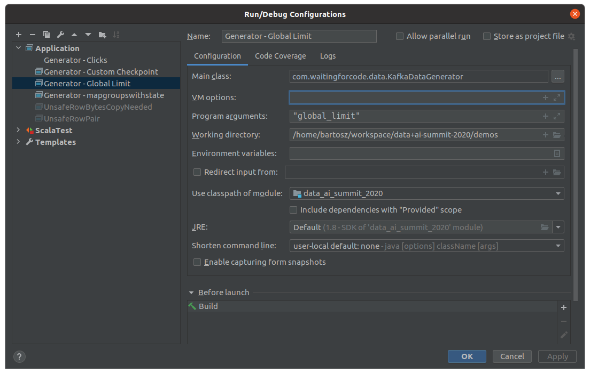

The repository illustrates my <a href="https://databricks.com/session_eu20/extending-apache-spark-beyond-spark-session-extensions" target="_blank">Data+AI Summit 2020 talk</a> and its <a href="https://www.waitingforcode.com/tags/data-ai-summit-europe-2020-articles" target="_blank">follow-up posts on waitingforcode.com</a>.

# Custom state store
The customized state store is based on <a href="https://jankotek.gitbooks.io/mapdb/content/quick-start/" target="_blank">MapDB embedded database</a>. 
You will find its implementation in [src/main/scala/com/waitingforcode/statestore](src/main/scala/com/waitingforcode/statestore) package and 
the corresponding follow-up blog posts under <a href="#">TODO: define me</a> tag.

## Testing
Custom state store scenarios can be tested by executing the applications from 
[src/main/scala/com/waitingforcode/stateful](src/main/scala/com/waitingforcode/stateful)
package:
- Start the Kafka broker image:
```
cd broker/
docker-compose down --volumes; docker-compose up
```
- Start the [src/main/scala/com/waitingforcode/data/KafkaDataGenerator.scala](KafkaDataGenerator.scala) 
corresponding to the scenario you want to test. You can find it in the 
`configurations` map defined at the beginning of your file. For example, to
execute the data generator for `GlobalLimitDemo`, chose the `global_limit` key
and start `KafkaDataGenerator "global_limit" `:



- Start the application from [src/main/scala/com/waitingforcode/stateful](src/main/scala/com/waitingforcode/stateful)
that you want to test.

- Once the application to test is ready, you can start to send the messages from
`KafkaDataGenerator` by pressing `Enter` button. This action will deliver all records 
from the next batch to send.

# TODOs
- [ ] define follow-up tag for custom state store
- [ ] define follow-up tag for custom checkpoint manager
- [ ] define follow-up tag for custom file committer
- [ ] define custom checkpoint manager
- [ ] define custom file committer